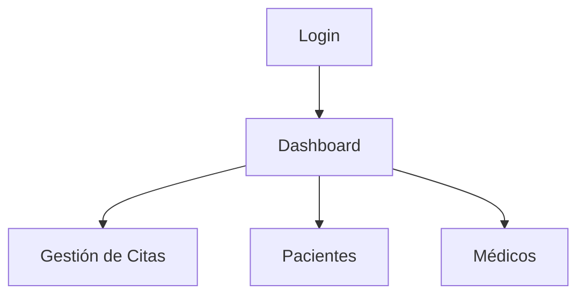

# 🏥 Hospital-Web


Sistema de gestión de citas médicas con interfaz administrativa.

## 🧩 Componentes principales

! ## 🚨 Requisitos previos
! - Node.js v16+
! - react-router-dom

## ✨ Features destacados
- Creación del Manifiesto y Configuración Inicial
- Integración de Service Worker para Gestión Avanzada de Caché
- Acceso a Periféricos del Sistema Operativo
- Consumo de API Externa para Datos Médicos
- Pruebas de Rendimiento y Optimización con Lighthouse

## Estructura

```js
EJ3MD6
├── dist
│   └── assets
│   └── service-worker.js
│   └── manifest.json
├── node_Modules
├── public
│   ├── images
│   │   └── doctor-portada.jpg
│   ├── vite.svg
│   ├── service-worker.js
│   ├── icon-192x192.png
│   ├── icon-512x512.png
│   ├── index.html
│   └── manifest.json
├── src
│   ├── assets
│   │   └── react.svg
│   ├── components
│   │   ├── AppointmentForm.jsx
│   │   ├── DoctorCard.jsx
│   │   ├── Footer.jsx
│   │   ├── Homepage.jsx
│   │   ├── Navbar.jsx
│   │   ├── DoctorDashboard.jsx
│   │   ├── PatientDashboard.jsx
│   │   ├── AdminDashboard.jsx
│   │   ├── Login.jsx
│   │   └── ServiceList.jsx
│   ├── features
│   │   ├── GeolocationAccess.jsx
│   │   ├── MedicationInfo.jsx
│   │   └── CameraAccess.jsx
│   ├── App.css
│   ├── context
│   │   └── AuthContext.jsx
│   ├── HOC
│   │   └── withLogger.jsx
│   ├── db
│   │   └── db.js
│   ├── App.jsx
│   ├── Context.jsx
│   ├── index.css
│   └── main.jsx
├── .gitignore
├── eslint.config.js
├── index.html
├── package-lock.json
├── package.json
├── postcss.config.js
├── tailwind.config.js
└── vite.config.js
```

## *Autor*
- [Alejandra Beltran.](https://github/LeenahJz)


-Créditos-
Imágenes de Google
https://t3.ftcdn.net/jpg/02/95/51/80/360_F_295518052_aO5d9CqRhPnjlNDTRDjKLZHNftqfsxzI.jpg

https://img.freepik.com/free-photo/woman-doctor-wearing-lab-coat-with-stethoscope-isolated_1303-29791.jpg?w=360

https://img.freepik.com/foto-gratis/atractivo-profesional-medico-uniforme-pie-brazos-cruzados-contra-fondo-aislado_662251-416.jpg

https://i.pinimg.com/736x/c5/a3/90/c5a3904b38eb241dd03dd30889599dc4.jpg

https://t4.ftcdn.net/jpg/02/60/04/09/360_F_260040900_oO6YW1sHTnKxby4GcjCvtypUCWjnQRg5.jpg

https://t3.ftcdn.net/jpg/01/30/45/54/360_F_130455409_fTuinPO1LXECv5hlk9VBREnL6yowYUo3.jpg


